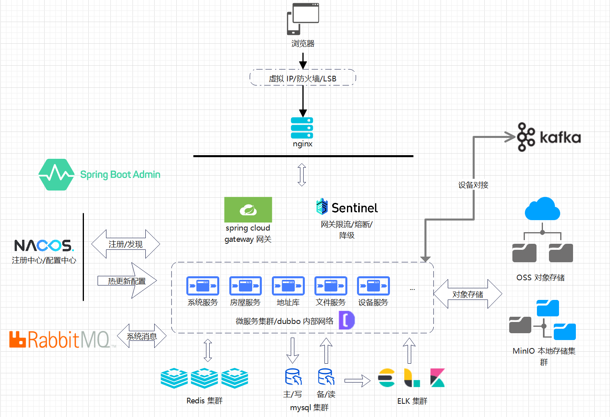

# Spring TayBct Single

[](./LICENSE)
[](https://github.com/taybct/spring-taybct-single/stargazers)
[](https://github.com/taybct/spring-taybct-single/network/members)

## 介绍
Spring TayBct Single 是一个 Spring 业务组件基础集成的基础业务（多模块单体架构），对一些常用的系统管理，
用户体系等基础功能做了基础的常用的简易的集成，并且提供一些业务开发过程中常用的功能模块集成，开箱即用。

## 软件架构

- 基于 spring boot 开发，版本和 spring boot 大版本基本同步，例如 spring-taybct 3.5.x -> spring-boot 3.5.x
- 适配一些 spring 相关的基础组件的简单基础集成
- 系统管理等一些基础通用业务模块的基础简易集成
- 本项目是单体架构，后续可以使用 `Spring Cloud Gateway` + `dubbo` 变成 [微服务](/taybct/spring-taybct-cloud)



## 安装教程

### 仓库模板

直接使用本仓库模板创建仓库即可

### 本地创建

[快速开始](https://mangocrisp.top/code/taybct/get-started/)

### Fork 本仓库

为了方便后续的更新和维护，你可以 Fork 本仓库到你自己的代码仓库

## 使用说明

1.  是运行的代码
2. **启动 VM 参数**

```bash
-Dmaven.wagon.http.ssl.insecure=true
-Dmaven.wagon.http.ssl.allowall=true
--add-opens
java.base/java.lang=ALL-UNNAMED
--add-opens
java.base/java.util=ALL-UNNAMED
--add-opens
java.base/java.nio=ALL-UNNAMED
--add-opens
java.base/sun.nio.ch=ALL-UNNAMED
--add-opens
java.base/java.lang.reflect=ALL-UNNAMED
# 基础内存设置
-Xms8g -Xmx8g
-XX:MaxMetaspaceSize=512m
# 使用ZGC
-XX:+UseZGC
-XX:MaxGCPauseMillis=150
# 解决CodeCache问题
-XX:ReservedCodeCacheSize=256m
-XX:+UseCodeCacheFlushing
# 日志与诊断
-Xlog:gc*,gc+age=trace,safepoint:file=ac/gc.log:time,uptime,level,tags:filecount=10,filesize=10M
-XX:+HeapDumpOnOutOfMemoryError
-XX:HeapDumpPath=./java_pid%p.hprof
-XX:NativeMemoryTracking=detail
```

> JVM 参数根据实际情况调整

## 参与贡献

1.  本项目是基于 [Spring Taybct](https://github.com/taybct/spring-taybct) 开发的多模块单体架构业务项目，参与贡献就去这里面

## 免责声明

本项目所有依赖包都是互联网能找到的，不能保证没有漏洞，源码也不能百分百保证没有 
BUG，谁都不能保证，所以，如果用于生产环境，出现了什么问题，本项目方不负任何责任，但是可以提供友情技术帮助和支持，你可以在项目的 
Issues 提出你的问题